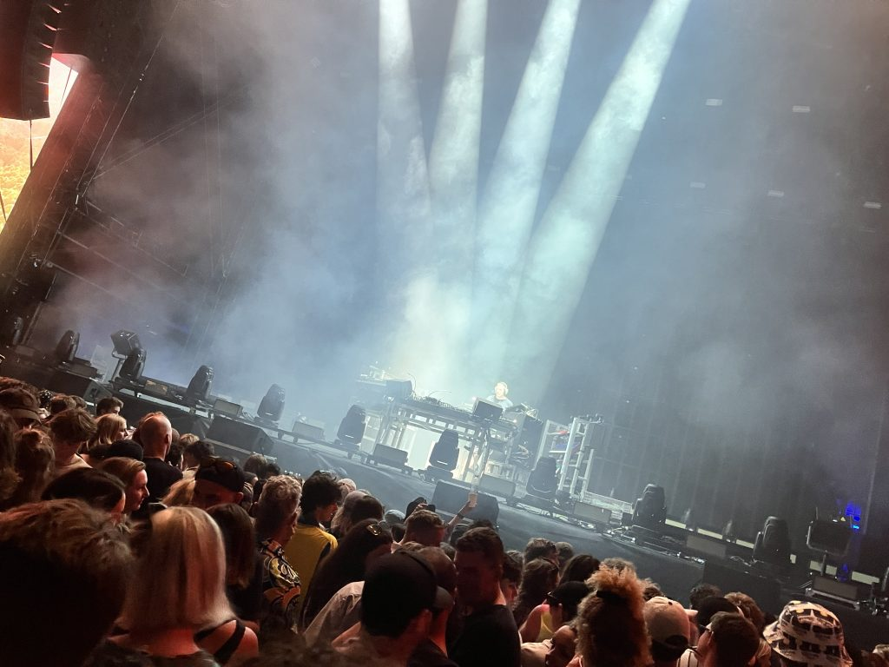
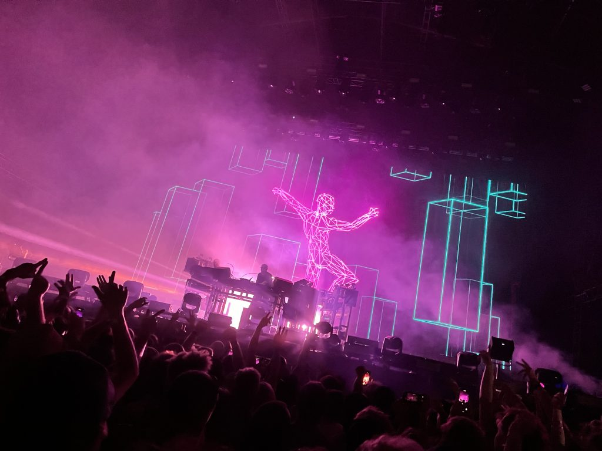
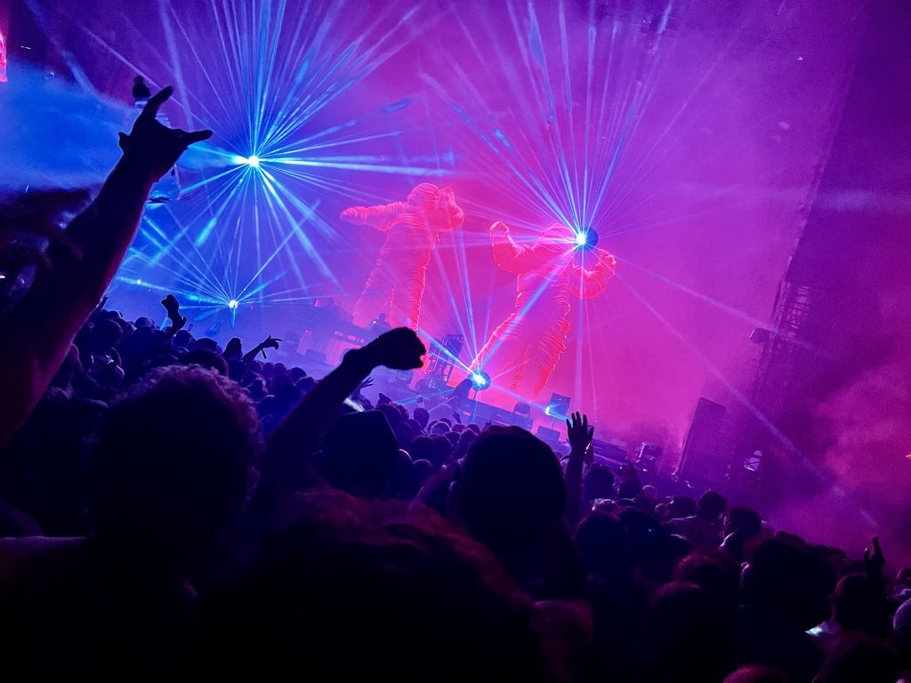
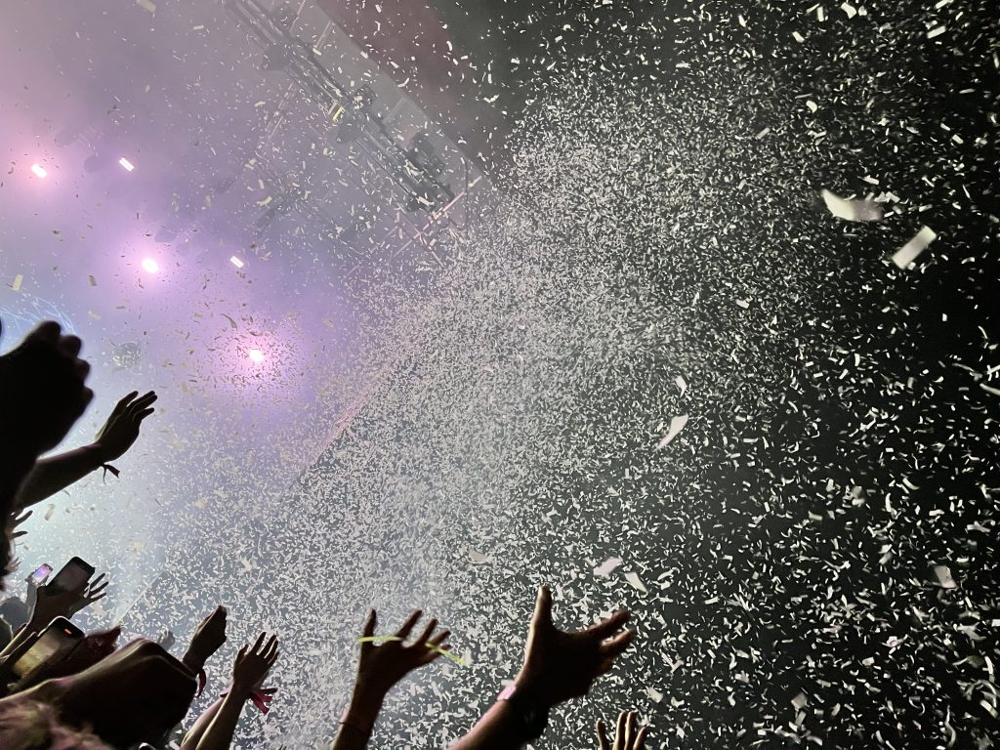
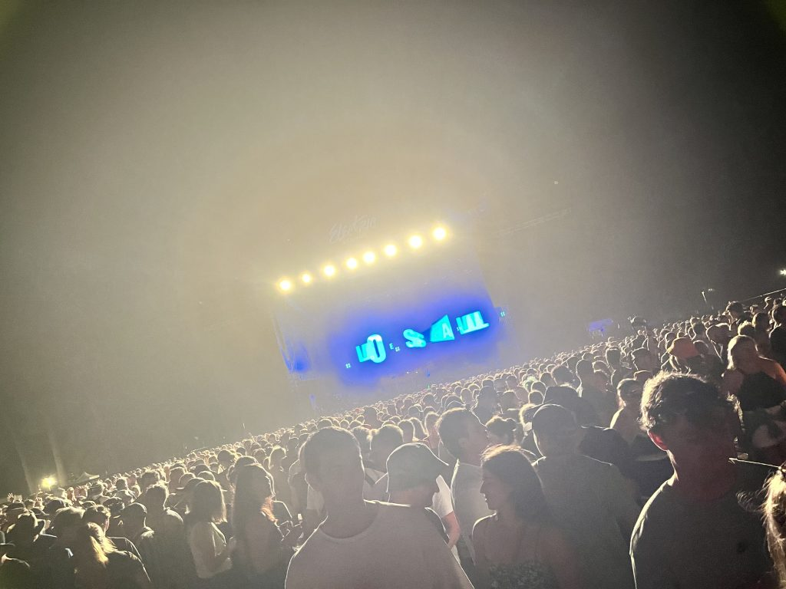

…is Chemical Brothers.

I just got home from Electric Avenue festival in Christchurch and it was superb. The crowd was young and old; there were 4 stages of a wide range of music; the day was well organised and low stress overall.

I thoroughly enjoyed myself all day, but the reason I went was to see Chemical Brothers. They didn't disappoint.

The hype and anticipation before they played was lovely. There was a mixtape of stripped-back chemical battle weapon type beats and lots of nerdery with racks of synths, torches and intense tech dudes setting up.

Even better, some crowd-manipulation genius had 660 play before Chem Bros on the main stage, and Hybrid Minds playing last in the huge tent stage next door. I think this is why the huge field in front of the main stage cleared out before Chem Bros, and it was easy to get up the front.

Also easy to get up the front, decide you need a piss, go have a piss miles away, get some water, then go back up the front (as I did).

<!-- wp:gallery {"linkTo":"none","align":"wide","className":"is-style-rectangular"} -->

<!-- /wp:gallery -->

The show blended edits and variations of many of the hits seamlessly, with lots of build-up-the tension ambient breaks paying off with huge, minimal beats &amp; subs to groove to.

<!-- wp:gallery {"linkTo":"none","align":"wide","className":"is-style-rectangular"} -->

<!-- /wp:gallery -->

The visual and "show" elements really added a lot, emphasising and complementing the music.

Lots of songs had animated visuals – repetitive visual "riff" loops, used much like a sample. Many of these were dancing characters or emotive "talking head" characters, mouthing those iconic samples. Other songs focused on lights and lasers, so you weren't tempted to spend too long watching screens.

Even better, the lights and visuals worked together, e.g. with lights shooting out from the screen to match a character shining a torch/lamp in your face.

Toward the end, two huge robot puppets appeared on stage. They seemed to be hanging out for a while, you could see their eyes through a lot of smoke. Then they started moving, and had lights &amp; screens in their guts, along with moving eyes. When they were done they drooped down and were wheeled off.

There was even an explosion of confetti, to really get that carnival vibe. It was a little weird since it was a damp day, I remember thinking "this must be biodegradable and maybe edible". It all disappeared pretty quick.

And also about 10-15 huge bouncing balls, chucked out into the crowd, then magically disppeared on cue somehow.

I didn't take too many photos, I probably took a couple too many videos.

Great times!

On the way out the screen was left with Love is All – from *Swoon*.

Go deeper to find out how they do it:

- [**Sound on Sound** interview with their tech guy **Matt Cox**](https://www.soundonsound.com/people/matt-cox-midi-tech-chemical-brothers), who has been with them since 1996.
- [**Semi Permanent** article on their long time visual collaborators **Adam Smith** & **Marcus Lyall**](https://www.semipermanent.com/stories/chemical-brothers-live).
  - And a [video covering similar info, and listing many specific models of light/laser](https://www.youtube.com/watch?v=_vU9fK493Z4).
- Good reviews from [**MusicTech**](https://musictech.com/news/events/the-chemical-brothers-live-review-o2-arena/) and [**The Guardian**](https://www.theguardian.com/music/2019/nov/22/chemical-brothers-review-a-glorious-meaningless-sensory-overload).
- **This live set from **Glastonbury** is similar to what I experienced**.

> There's no point having that many pieces of equipment if you're not going tospend the time
> 
> - **programming**
> - **planning**
> - **creating something**.
>
> *Adam Smith*
