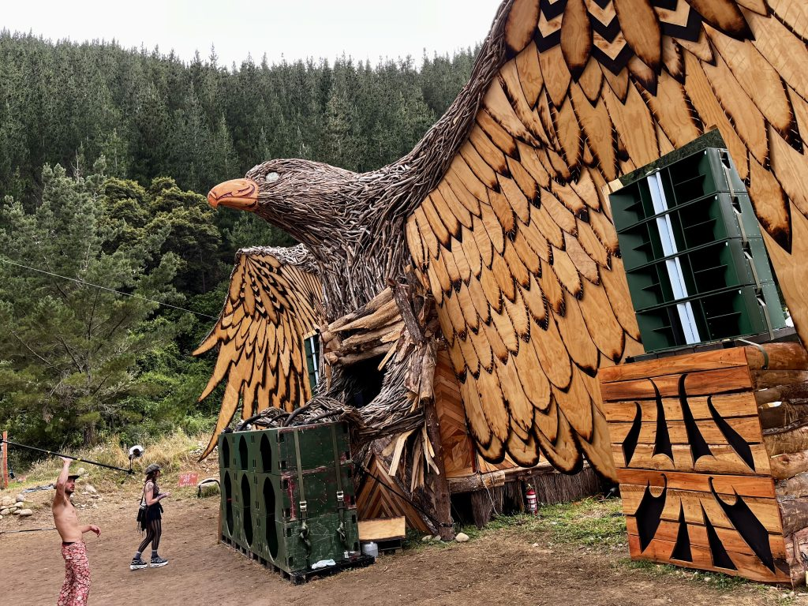
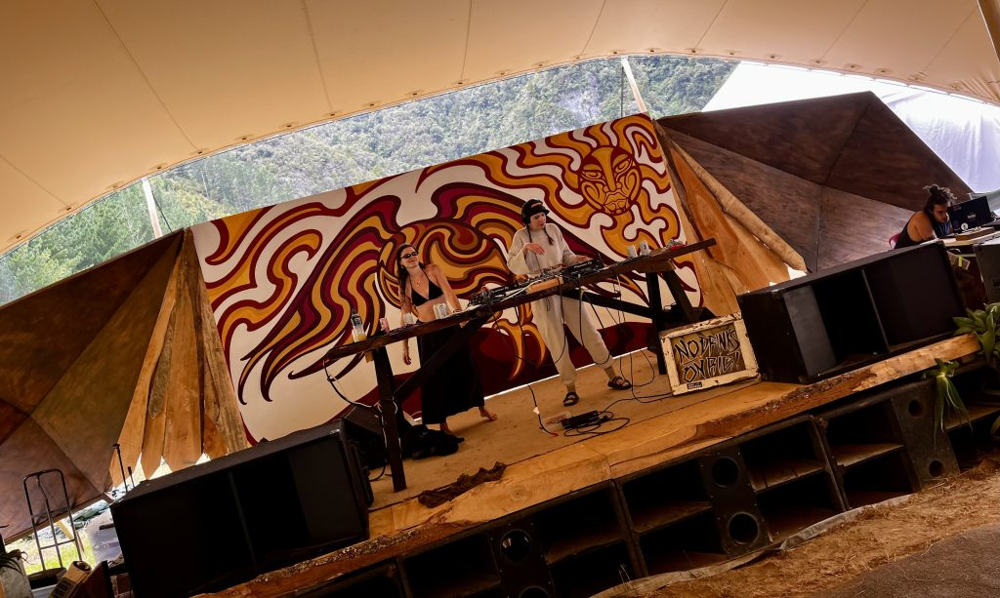
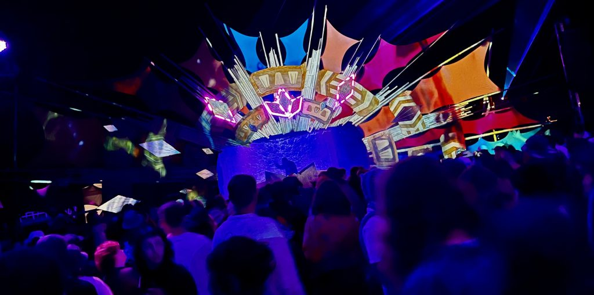
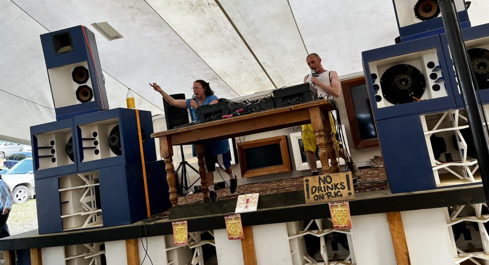
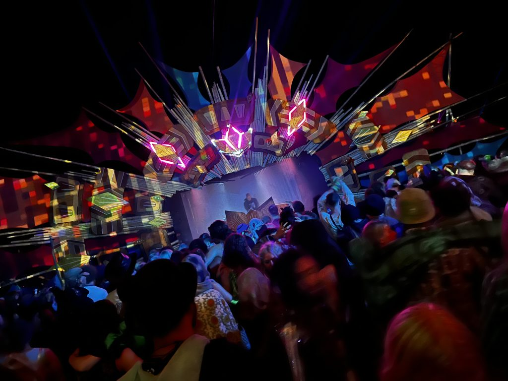
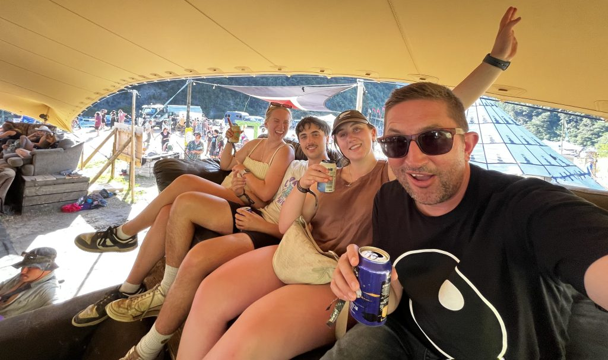

I had an absolute blast at my first ever Twisted Frequency.

First, I was invited to play a leftfield ambient set in the Dojo. There are so many dark, weird and spacious artists I spend a lot of time exploring, so it was great to focus on this sound – a complete left turn from my normal house-grooves vibe.

<iframe width="100%" height="166" scrolling="no" frameborder="no" allow="autoplay" src="https://w.soundcloud.com/player/?url=https%3A//api.soundcloud.com/tracks/2006476707&color=%23ff5500&auto_play=false&hide_related=false&show_comments=true&show_user=true&show_reposts=false&show_teaser=true"></iframe>
<a href="https://soundcloud.com/haszari" title="haszari" target="_blank" style="color: #cccccc; text-decoration: none;">haszari</a> · <a href="https://soundcloud.com/haszari/ambient-leftfield-dojo-twisted-frequency" title="Ambient leftfield @ Dojo, Twisted Frequency" target="_blank" style="color: #cccccc; text-decoration: none;">Ambient leftfield @ Dojo, Twisted Frequency</a>

Interspersed within these masterworks, I dropped some beatless edits of my tunes…

…including one that I hastily prepared on the drive in!

Listen through to the end of the [mix](https://soundcloud.com/haszari/ambient-leftfield-dojo-twisted-frequency?in=haszari/sets/mixes) to hear a nod to one of my all time favourite surreal TV shows (not made by David Lynch) – *[The Leftovers](https://en.wikipedia.org/wiki/The_Leftovers_(TV_series))*. Also a nod to **[Max Richter](https://en.wikipedia.org/wiki/Max_Richter)** and the **[Pixies](https://en.wikipedia.org/wiki/Pixies_(band))**, coming together in a few piano notes.

### Highlights

The real highlights were:

- Swimming in the river every day (except for leaving day, when my urgent kids rushed me to pack up!).
- Chilling "watching tennis" at the skateramp.
- The Chillery stage in general:
  - Biggest house-grooves quotient by far, especially sundown house, the best kind.
  - Under cover but still very open.
- Downtime. Forgetting about time and messaging/internet/the world for five days.

The stage design / production / soundsystems, and constant four channel 24x7 festival grooves were also a massive highlight. The specific highlights below are just a wee taster of some acts that stood out to me.

---

**[The Horse](https://soundcloud.com/naomi-t-black)** laid down a block party set of ghetto hip-hop, perfect way to kick off an afternoon. I love it when DJs are having as much fun getting down as the crowd (or more).

---

**[Ebb](https://soundcloud.com/ebb-nz)** played an absolute blinder of a festival headliner set, in the best way. His set straddled new years eve, so the first half was rinse-step-drop-repeat for 30 mins, then fireworks, then into the techno.

---

**[E-Kare](https://e-kare.bandcamp.com/)** made an outsize impact with their ~12 minute set, a masterclass in performance and engaging the audience. Some tricks that I have learned from watching them do their thing:

- While doing soundcheck, repeatedly tell the audience: "This is not the set. When we start doing our set, you'll know." Hype.
- When you finish soundcheck, personally greet everyone in attendance.
  - Don't forget to greet any walk-ins mid-way through set too!
- Short songs are fine. Even better if you have one slightly longer song, and every other song is the exact same length. Tell the audience this, active expectation!
- Vocals.

---

**Headland** played two sets – a dark dubby afternoon set on the main stage and a crisp, dark digital-dub set at Beat Bach (above). Absolutely loved both.

---

Shouts out to my gang slash family! Like us, if you work at it, you will achieve Top Couch®. 

See ya next year!

