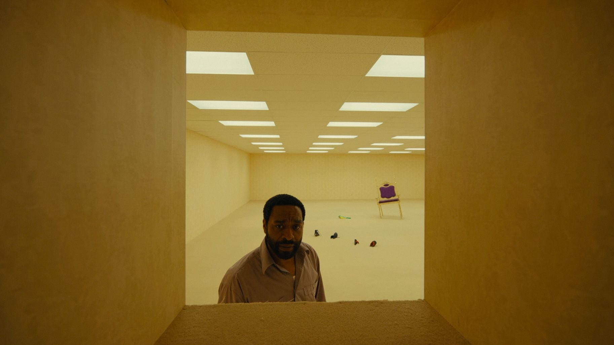
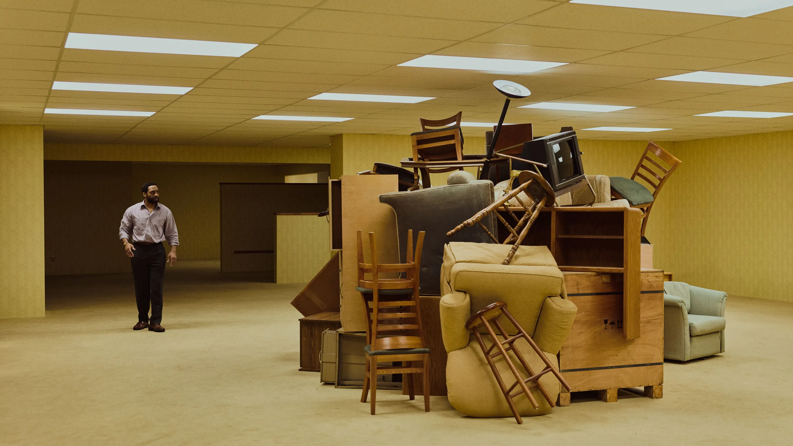

> Generic public architecture, abandoned offices, malls … share certain traits. They are devoid of human life” 

This article [**What Art History Can Reveal About the *Backrooms* Aesthetic**](https://ocula.com/magazine/opinion/art-history-backrooms-film-aesthetic-artists-2026/) totally gets at what I loved about the film [*Backrooms*](https://letterboxd.com/film/backrooms-2026/).

> The furniture-strewn, labyrinthine corridors of box office hit *Backrooms* evoke a strange nostalgia in which uneasy familiarity triggers memory, a phenomenon the art world has long explored.

{/* future - add Nontemplate page soundtrack */}